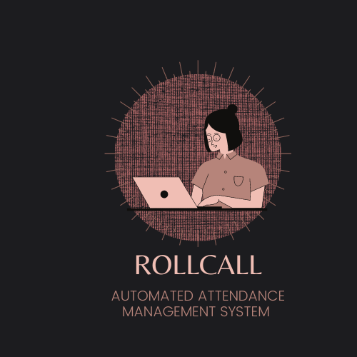

[](https://gitpod.io/#https://github.com/Swarnimashukla/Automatic-attendance-management-system)

# Automatic-attendance-management-system (ROLLCALL)

## Hey Coder :👋 

Attendance is an important part of our education system. Especially in schools in rural areas where the government uses these attendances for their schemes which they introduce to promote education. The daily attendance of the student is used for the ordering of mid-day meals by the government. But any malpractice related to marking the attendance of students results in individuals making a profit at the cost of the future of India. On top of that, the food wastage that happens because of this is problematic. There have been numerous reports regarding the malpractice in attendance of the students.

ROLLCALL an automatic and smart attendance marking and management system which uses Microsoft Azure’s Cognitive service at its core to create a system that could make sure that no human intervention is required and provides the government the ability to monitor the attendance of the schools and helps the government officials in mark fake schools.

Project

### Why this project ?

* To automate the traditional attendance marking process
* To help government officials keep track of education structure
* To create a better learning environment and improve the education system 

# Award Winning idea :✨🏆✨


### Functionalities 

 * Student enrolment
 * Image pre-processing and noise removal
 * Model training
 * Face Detection
 * Database Creation For Attendance
 * Final Report Generation

## USP 

* We provide a system which captures attendance of the whole class in one click 
* To maintain accuracy we capture faces for 5 times in one hour class without any involvement 
* Using Microsoft Azure services for maintaining accuracy 

## Hardware used 

1. Raspberry pi
2. Raspberry pi camera V2
3. Powerbank ( optional - for electricity issue )

## Software used

				

## Contribution Guidelines

* Write clear meaningful git commit messages (Do read [this](https://chris.beams.io/posts/git-commit/)).

* Make sure your PR's description contains GitHub's special keyword references that automatically close the related issue when the PR is merged. (Check [this](https://github.blog/2013-05-14-closing-issues-via-pull-requests/) for more info)

* When you make very very minor changes to a PR of yours (like for example fixing a text in the button, minor changes requested by reviewers) make sure you squash your commits afterward so that you don't have an absurd number of commits for a very small fix. (Learn how to squash at [here](https://davidwalsh.name/squash-commits-git))

* When you're submitting a PR for a UI-related issue, it would be awesome if you add a screenshot of your change or a link to a deployment where it can be tested out along with your PR. It makes it very easy for the reviewers and you'll also get reviews quicker.

**1.**  Fork [this](https://github.com/Swarnimashukla/Automatic-attendance-management-system) repository.

**2.**  Clone your forked copy of the project.

```
git clone --depth 1 https://github.com/<Yourname>/Automatic-attendance-management-system.git
```


**3.** Navigate to the project directory:file_folder.
```
cd Automatic-attendance-management-system
```

**4.** Add a reference(remote) to the original repository.

```
git remote add upstream https://github.com/Swarnimashukla/Automatic-attendance-management-system 
```

**5.** Check the remotes for this repository.

```
git remote -v
```

**6.** Always take a pull from the upstream repository to your master branch to keep it at par with the main project(updated repository).

```
git pull upstream master
```

**7.** Create a new branch.

```
git checkout -b <your_branch_name>
```

**8.** Add your changes to the Project.


**9.** Track your changes :heavy_check_mark: .

```
git add . 
```

**10.** Commit your changes .

```
git commit -m "Relevant message"
```

**11.** Push the committed changes in your feature branch to your remote repo.

```
git push -u origin <your_branch_name>
```

**12.** To create a pull request, click on `compare and pull requests`. Please ensure you compare your feature branch to the desired branch of the repo you are supposed to make a PR to.


**13.** Add appropriate title and description to your pull request explaining your changes and efforts done.


**14.** Click on `Create Pull Request`.

## GSSoC FAQs

**Q1. Will a beginner, with absolutely no knowledge of github, gain anything fruitful?**

Yeah, definitely. The organization is meant to assist the beginners grow in the field of development. GirlScript have distinct projects appropriate both for beginners as well as the accolades and thereby they will make sure that each and every participant gets to learn something new from the projects he or she is contributing for.

**Q2. Is there any registration fee?**

No, there is no registration fees for participation. It is absolutely free of cost.

**Q3. Any age limit for participation?**

No, there is no age limit for participation in GSSoC. It is open for all.

**Q4. How will we receive the prizes (if won) and certificate?**

GirlScript will be providing all the participants with the digital certificate. The prize money to all the concerned students will be sent to their bank accounts. GirlScript will ask for the bank account details via an email after the conclusion of the event.

**Q5. By what time will the result come?**

The results will be declared in the first week of June

**Q6. Is it strictly for girls or can boys also participate?**

GirlScript aims to assist anyone who is new in the field of development and it specifically supports an inclusive environment. Thereby GSSOC is open both for girls and for boys. Everyone can participate and contribute their part in the development of open source community and our initiative.

**Q7. From where do we need to start being a beginner as of now so as contribute properly in the projects?**

GirlScript will be providing you with the links on their official website to start with Github and various other development to make sure that everyone is able to aptly contribute for the projects.

**Q8. How will participants communicate with mentors and admin?**

All communication will happen on the Discord channel for this project.

**Q9. How will I know that I am selected?**

The participants will be notified through email and an invite to the Discord channel will be sent to them.

**Q10. What is the criterion for selection as a participant?**

This program is for beginners to get started with open source. The only criterion for selection are your dedication and enthusiasm to contribute to open source.

## Project Admin 😊

<table>
	<tr>
    <td align="center">
            <a href="https://github.com/Swarnimashukla">
              <br />
              <sub><b>Swarnima Shukla</b></sub>
            </a><br/>
   </td>
	</tr>
	</table>
	
	
## Project Mentors ✨✨

<table>
	<tr>
   <td align="center">
            <a href="https://github.com/bhubesh757">
              <br />
              <sub><b>Bhubesh SR</b></sub>
            </a><br/>
   </td>
   <td align="center">
            <a href="https://www.github.com/SKAUL05">
              <br />
              <sub><b>Sarath Kaul</b></sub>
            </a><br/>
   </td>
   <td align="center">
            <a href="https://github.com/suyashgautam">
              <br />
              <sub><b>Suyash Gautam</b></sub>
            </a><br/>
   </td>
  </tr>
</table>

## Connect with me on 

[Linkedin](https://www.linkedin.com/in/swarnima-shukla-3815b5b8/) | [Twitter](https://twitter.com/swarnimashukla5) | [Instagram](https://www.instagram.com/swarnimashukla_/)

## Don't forget to leave a 🌟 if you like this repo 

